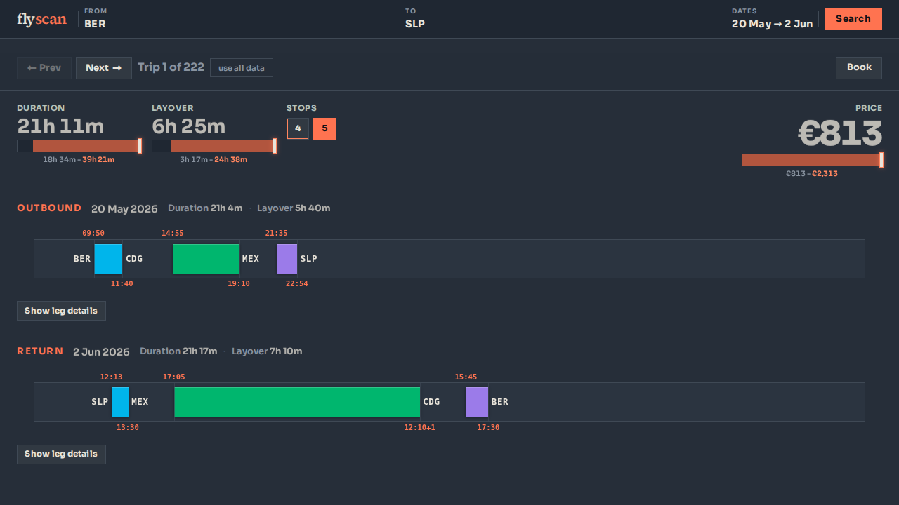

# flyscan



**flyscan** compares flight itineraries from **Skyscanner** and **Kiwi** by scraping FlightsFinder-style portal pages, then normalizing trips, deals, and flights into shared schemas. The web UI lets you filter by price, duration, and stops, and inspect each itinerary (route, legs, timeline) before opening a book link.

## Quick start

```bash
bun install
bun run web
```

Open the URL printed in the terminal (default `http://localhost:3010`).

## Main scripts

| Command | Description |
| -------- | ----------- |
| `bun test` | Unit tests |
| `bun run verify-fixtures` | Validate bundled fixture HTML against parsers |
| `bun run demo` | CLI demo searches |
| `bun run web` | Web UI + API (`POST /api/search`, `GET /api/fixture-demo`) |
| `bun run serve` | Standalone fake portal server (`/portal/*` routes) |

## API

- **`POST /api/search`** — Live scrapes. Body: `origin`, `destination`, `departureDate`, optional `returnDate`, optional `sources` (default: both `skyscanner` and `kiwi`). The bundled UI always requests both sources.
- **`GET /api/fixture-demo`** — Frozen snapshot from `fixture.ts` (same shape as the live response).

## Notes

- Demo data for the **Load demo** control comes from `fixture.ts`.
- Prices are shown in **EUR**, rounded to whole units in the UI.
- Skyscanner polling can be tuned with env (e.g. `FX_POLL_MAX_RETRIES`); see `skyscanner/search.ts`.

## Project layout

- `skyscanner/`, `kiwi/` — Source-specific scraping and parsing
- `web/client/` — React frontend (`vite` build → `web/public/dist/`)
- `web/server.ts` — Static UI + JSON API
- `fixture.ts`, `fixturePortal.ts` — Demo snapshot and fake portal fixtures
