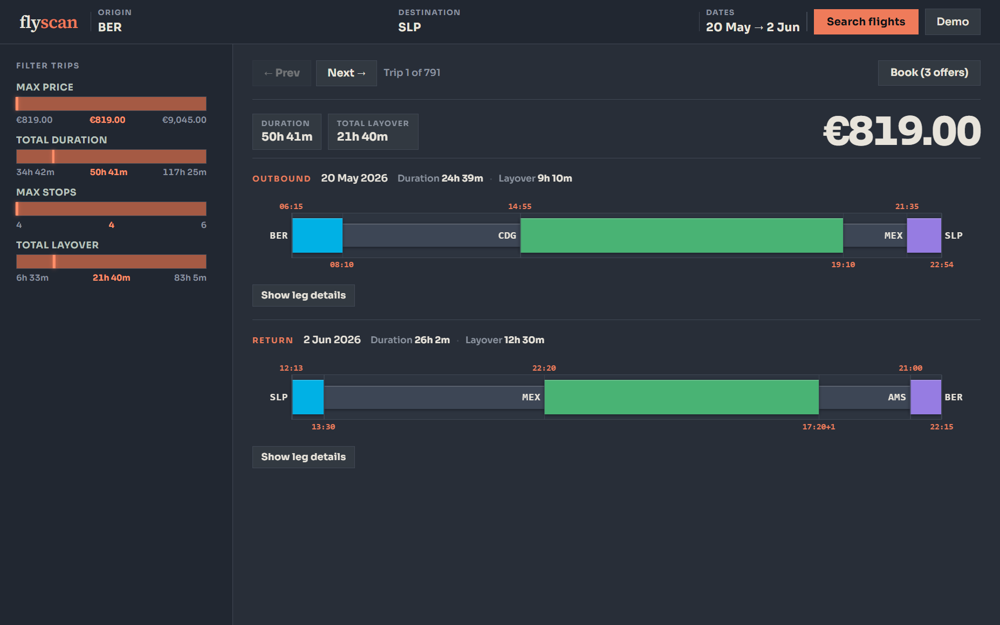

# flyscan



flyscan compares flight itineraries from **Skyscanner** and **Kiwi** by scraping FlightsFinder-style portal pages, then normalizing trips/deals/flights into shared schemas.

## Quick start

```bash
bun install
bun run web
```

Open the URL printed in the terminal (default `http://localhost:3010`).

## Main scripts

- `bun test` — unit tests.
- `bun run verify-fixtures` — validate bundled fixture HTML against parsers.
- `bun run demo` — run CLI demo searches.
- `bun run web` — run web UI + API (`POST /api/search`, `GET /api/fixture-demo`).
- `bun run serve` — run standalone fake portal server (`/portal/*` routes).

## Notes

- UI always queries both sources (`skyscanner` + `kiwi`).
- Demo data comes from `fixture.ts`.
- Prices are displayed in EUR and rounded to whole units in the UI.

## Project layout

- `skyscanner/`, `kiwi/` — source-specific scraping and parsing.
- `web/client/` — frontend app.
- `web/server.ts` — web/API server.
- `fixture.ts`, `fixturePortal.ts` — demo and fake portal fixtures.
