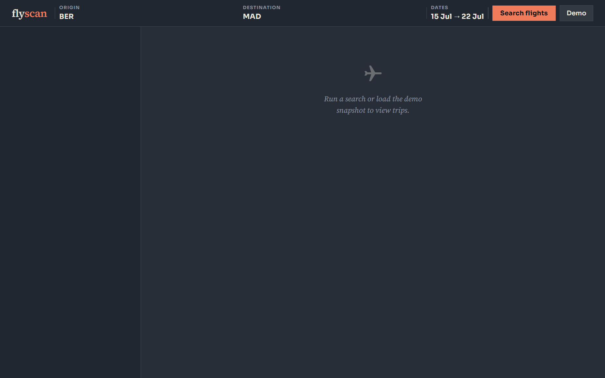

# fx

Scrape flight search results from **Skyscanner** and **Kiwi.com** flows exposed through **FlightsFinder-style** portal HTML (initial page plus poll/search responses). The pipeline uses **[Effect](https://effect.website/)**, **[Bun](https://bun.sh/)**, and **cheerio** to parse trips, legs, flights, and priced booking options into shared schemas (`schemas.ts`).

## Requirements

- [Bun](https://bun.sh/) (see `package.json` for typical versions).

```bash
bun install
```

## Scripts

| Command | Purpose |
| --- | --- |
| `bun test` | Unit tests (parsers, utils, graph dedupe). |
| `bun run verify-fixtures` | Checks bundled poll HTML vs parsers (Skyscanner + Kiwi). Can take ~1–2 minutes on large Skyscanner samples. |
| `bun run demo` | Runs Skyscanner + Kiwi searches (`--real` hits production; default uses fake portal origin — see below). |
| `bun run web` | Flight UI + **`POST /api/search`** (live scrapes only) + **`GET /api/fixture-demo`** (frozen payload from `fixture.ts` for the demo button). |
| `bun run serve` | Standalone Effect HTTP server serving sample portal routes only (`PORT`, default **3000**). Useful for CLI/tests without the web app. |

## Web UI

- Open the URL logged by `bun run web` (e.g. `http://127.0.0.1:3010`).
- **Sources are fixed** to both **Skyscanner + Kiwi** (no picker). **Search flights** always hits live FlightsFinder (`POST /api/search`) with both feeds requested.
- **Demo** loads the saved JSON export in **`fixture.ts`** via **`GET /api/fixture-demo`** (no scrape); it also aligns form fields with that snapshot’s `input`. The first server start after install parses that file once (large snapshots can add several seconds).
- Successful responses are **merged in the browser** into a **single list**: trips ordered by **lowest best fare**, with booking offers grouped per itinerary.
- Prices are normalized for display as **EUR** values (source payload prices are stored in cents).
- Each itinerary timeline includes a **Show/Hide leg details** toggle for expandable leg rows beneath the bar.

### Screenshots (current app state)

Empty state:



Demo-loaded results state:


## Scraping behavior (summary)

- **Skyscanner**: GET initial HTML → poll until finished → parse poll HTML. Multiple **Book Your Ticket / `._similar`** rows per itinerary produce **multiple deals** sharing one trip.
- **Kiwi**: GET initial → POST search/poll → parse.
- After parse, **`dedupeParsedDealsData`** collapses duplicate **ids** in flights, trips, legs, and deals (first wins) before returning `SearchResult` metadata counts.

### Fake portal routes (`bun run serve` only)

The **`bun run web`** process does **not** expose `/portal/*`. Use the standalone fake server for CLI/offline scrapes:

- `GET /portal/sky`, `POST /portal/sky/poll`
- `GET /portal/kiwi`, `POST /portal/kiwi/search`, `POST /portal/kiwi/poll`

## Environment variables

| Variable | Used by | Notes |
| --- | --- | --- |
| `WEB_PORT` | `web/server.ts` | HTTP port for UI + API (default `3010`). |
| `PORT` | `bun run serve`, `utils.fakeServerPort` | Standalone fake portal port (default `3000`). |
| `FIXTURE_HTTP_ORIGIN` | `utils.fakeServerOrigin` | When set, scrapers in **fake** mode target this origin instead of `127.0.0.1:$PORT` (e.g. set manually when pointing fake scrapes at another host). |
| `FX_POLL_MAX_RETRIES` | `skyscanner/search.ts` | Max Skyscanner poll attempts (default `180`, 1s apart). |

## Layout

- `skyscanner/`, `kiwi/` — config, HTTP requests, HTML extractors, `parseHtml`, `search.ts`, fake handlers.
- `web/client/` — frontend app (`src/` components, transforms, styles entrypoint).
- `web/public/` — shared/static styles and assets served by the web process.
- `fixturePortal.ts` — reads sample HTML and portal cookie headers for tests and `bun run serve`.
- `fixture.ts` — optional large demo snapshot (`export const fixture`) for **`GET /api/fixture-demo`** / UI button.
- `scripts/demo.ts`, `scripts/verifyFixtures.ts` — CLI helpers.

## Legal / etiquette

Respect FlightsFinder and airline partners’ **terms of use** and **robots** guidance. Prefer **local fixtures** for development and CI; use **live** mode sparingly and responsibly.
